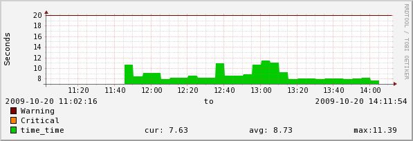

==========================
Synthetic Web Transactions
==========================

Description
===========
This ZenPack provides monitoring of multi-step web transactions. 
The ZenPack leverages Twill_ scripts to monitor websites

Usage
=====
After installing the ZenPack (noting the dependencies), add the desired website 
as a device making sure your "discovery protocol" is set to None and that 
SNMP monitoring is disabled (zSnmpMonitorIgnore = 'True').
 
To monitor a site, you need to create a twill script - To learn how to create 
a twill script, visit: Twill_ (very simple to do! Hint: use the twill-sh 
interactive prompt to step through the transaction you wish to perform on 
your website) Make sure the name of this script matches the name of your 
device. (i.e. if you are monitoring www.zenoss.com - name the script 
www.zenoss.com and save it as a text file)

------------
An example script looks something like this:

   setlocal username 
   setlocal password 
   go http://www.slashdot.org/
   formvalue 1 unickname $username
   formvalue 1 upasswd $password
   submit
   code 200  # make sure form submission is correct!

Which would log into slashdot with the username and password provided and 
check to see what the return code is. You can continue adding to this 
script by adding lines like "follow <link name>, or formvalue 1 <field> 
<value to add to form>, etc....
 
To get the best test, make sure you perform many operations within your 
twill script to verify the accuracy of the synthetic transaction. Click around, 
fill out forms, post information, and log out to make sure everything is 
working end-to-end on your site. The more detailed your transaction, the more 
accurate your test.

Helpful commands to use in twill:

   showforms
   show
   follow <link name>

------------

Copy your twill script to the scripts directory of the ZenPack -
$ZENHOME/ZenPacks/ZenPacks.synthetictransactions.SonnyStormes-<ver>.egg/ZenPacks/SonnyStormes/synthetictransactions/scripts
 
To test all the components and ensure they are in working order:

# Go to /Devices/Websites/Templates and select the "Synthetic Transactions" 
  template.
# Select the data source "transaction_time"
# In the field "Test against device" enter the name of the website and click 
  the "test" button. 
  The result should be "SYNTHETIC TRANSACTION SUCCESSFUL|time=X.XX;;;0.00". 
  If the transaction does not complete successfully, the message will read 
  "SYNTHETIC TRANSACTION FAILED|time=X.XX;;;0.00" and a alert will be 
  generated at the critical level.
# Adjust the Critical and Warning Thresholds to your desired level
 
If everything is in working order, bind the template to the devices.
 
As an example, I have included a small script that uses www.zenoss.org to get 
you started on your twill script creation.

Screenshots
===========
|screen_shot|

Requirements & Dependencies
===========================
* Zenoss Version: 2.x, 3.x, 4.x
* ZenPack Dependencies: None
* External Dependencies: twill (As of 1.1, the pack will attemp to 
  automatically install twill if its not already installed)

Installation
============

Change History
==============
* 1.0

  * Initial Release

* 1.1

  * Updated to reflect new name space of
    `ZenPacks.SonnyStormes.synthetictransactions` instead of the previous
    `ZenPacks.synthetictransactions.SonnyStormes`
  * Basic testing on Core 4
  * Updated installation process to create the device class */Devices/Websites*.
    It is no longer necessary to create this device class manually
  * Updated installation process to check if twill is already installed. If
    it is not found, the installer will attempt to install it using
    easy_install. Should the installer fail to install twill, it will log 
    that to the console output, and stop the installation

.. External References Below. Nothing Below This Line Should Be Rendered
.. _Twill: http://twill.idyll.org/

